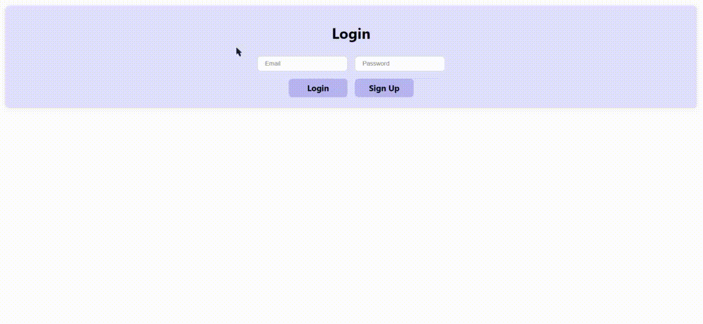

#### Extending the server by a new app

The server can also be extended by creating a new app. This example can be viewed or in full or cloned at the `ca/test-auth` branch in the GitHub repository. The following steps will be a guide to creating a new app called `test_auth` with a new model call `Click`.

<span style="color:red">1.</span> Create a new app using the following command:

```bash
python manage.py startapp test_auth
```

<span style="color:red">2.</span> Add the app to the installed apps in the `server/settings.py` file:

```python
INSTALLED_APPS = [
    'django.contrib.admin',
    'django.contrib.auth',
    ...
    'core',
    'test_auth',    # ***New app***
]
```

<span style="color:red">3.</span> Add a `managers.py` file to the `test_auth` directory. This file will contain the manager for the new model. The `manager.py`, `models.py`, and `views.py` files can also be modularized into separate directories like the `core` app. Here they are all in the same directory for simplicity.

The test_auth directory will look like this:

```bash
test_auth/
    __init__.py
    migrations/
    admin.py
    apps.py
    managers.py  # ***New manager file***
    models.py
    tests.py
    views.py
```

<span style="color:red">4.</span> Add the new model to the `models.py` file:

```python
from django.db import models
from test_auth.managers import ClickManager

class Click(models.Model):

    class Meta:
        db_table = 'test_auth_click'

    id = models.AutoField(primary_key=True)
    clicked_at = models.DateTimeField(auto_now_add=True)
    user = models.ForeignKey('core.CustomUser', on_delete=models.CASCADE)

    objects = ClickManager()

    def __str__(self):
        return f'{self.user} clicked at {self.clicked_at}'
```

<span style="color:red">5.</span> Add the new manager to the `managers.py` file:

```python
from django.db import models
from django.utils import timezone


class ClickManager(models.Manager):
    def create_click(self, user):
        new_click = self.create(user=user)
        new_click.save()
        return new_click
    
    def get_click(self, id):
        return self.get(id=id)
    
    def get_clicks_by_user(self, user):
        return self.filter(user=user)
    
    def get_latest_click_by_user(self, user):
        return self.filter(user=user).latest('clicked_at')
```

<span style="color:red">6.</span> Add the new views to the `views.py` file:

```python
from django.http import JsonResponse
from django.contrib.auth.models import User
from django.contrib.auth import get_user_model

from test_auth.models import Click

from rest_framework.decorators import api_view

from core.decorators.token_decorators import validate_token
from core.decorators.user_decorators import validate_user

User = get_user_model()

@api_view(['POST'])
@validate_token
def click(request):
    user_id = request.data.get('user_id')
    user = User.objects.get(id=user_id)

    click = Click.objects.create_click(user)
    return JsonResponse({'id': click.id, 'clicked_at': click.clicked_at}, status=201)

@api_view(['GET'])
@validate_token
@validate_user
def get_clicks(request, user_id):
    user = User.objects.get(id=user_id)

    clicks = Click.objects.get_clicks_by_user(user)
    return JsonResponse({'clicks': [{'id': click.id, 'clicked_at': click.clicked_at} for click in clicks]}, status=200)
```

<span style="color:red">7.</span> Add the new views to the `server/urls.py` file:

```python
from django.contrib import admin
from django.urls import path
from core.views import (
    register as RegisterView,
    login as LoginView,
    logout as LogoutView,
    me as MeView,
    # test views
    test_token as TestTokenView,
    test_protected as TestProtectedView,
    sessions as SessionsView,
)

from test_auth.views import (   # ***Import new views***
    click as ClickView,
    get_clicks as GetClicksView,
)

urlpatterns = [
    path('admin/', admin.site.urls),
    path('register/', RegisterView, name='register'),
    path('login/', LoginView, name='login'),
    path('logout/', LogoutView, name='logout'),
    path('sessions/', SessionsView, name='sessions'),
    path('me/', MeView, name='me'),
    # test views
    path('test-token/', TestTokenView, name='test-token'),
    path('test-protected/', TestProtectedView, name='test-protected'),
    path('click/', ClickView, name='click'),        # ***New url***
    path('get-clicks/<int:user_id>/', GetClicksView, name='get-clicks'),    # ***New url***
]
```

<span style="color:red">8.</span> Run the following commands to create the migrations and migrate the database:

```bash
python manage.py makemigrations
python manage.py migrate
```

<span style="color:red">9.</span> To test the new views, the home page on the client side was modified to include a button that sends a POST request to the new click view. The following code was added to the `client/src/components/home/_home.js` file.

<span style="color:red">10.</span> Run the server and client to test the new views.

